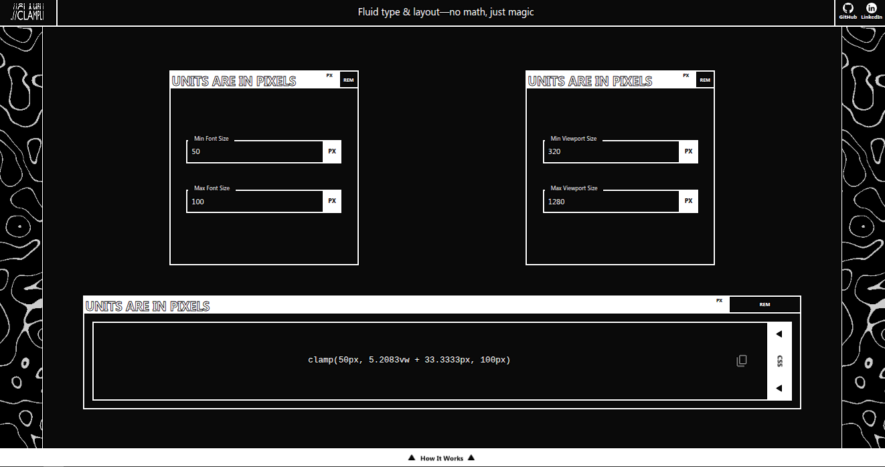
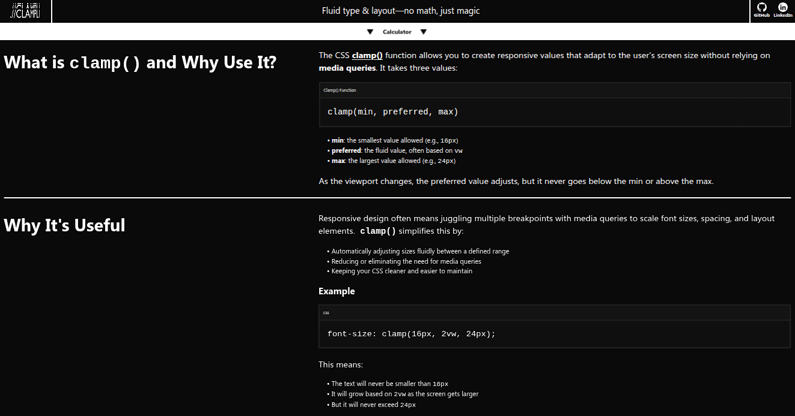

# Clampli

**Clampli** is a responsive CSS `clamp()` generator made for designers and developers who want fluid typography and layout scaling without the math. Just input your min/max viewport widths and sizes, and get a clean `clamp()` formula you can plug directly into your CSS or TailwindCSS.

## Screenshots

### Desktop



## Features

- Generate `clamp()` formulas instantly for both CSS and TailwindCSS
- Viewport-based scaling for text or elements
- One-click copy to clipboard
- Fast, smooth UI built with React + Vite
- Clean, modern interface

## Getting Started

### 1. Clone the repo

```bash
git clone https://github.com/auilk/Clampli.git
cd Clampli
```

### 2. Install dependencies

```bash
npm install
```

### 3. Start the dev server

```bash
npm run dev
```

## Tech Used

- [React.js](https://react.dev/) (with [Vite](https://vite.dev/))
- [TailwindCSS](https://tailwindcss.com/)
- [Zustand](https://zustand-demo.pmnd.rs/)

## Contributing

Contributions, ideas, and pull requests are welcome!

1. Fork the project

2. Create a branch: 
```bash
git checkout -b feature/your-feature
```

3. Commit your changes: 
```bash
git commit -m 'Add something'
```

4. Push: 
```bash
git push origin feature/your-feature
```

5. Open a pull request

## License

This project is under the MIT License. See [LICENSE](LICENSE) for more detail